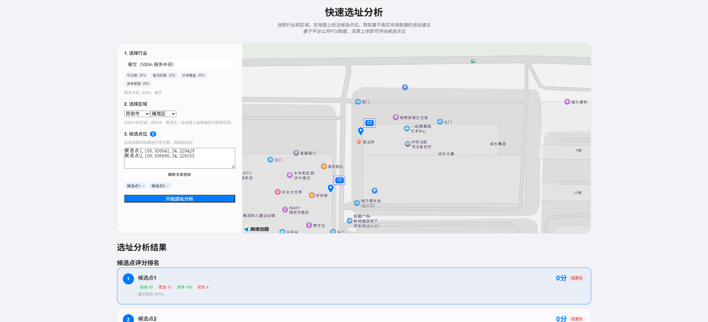
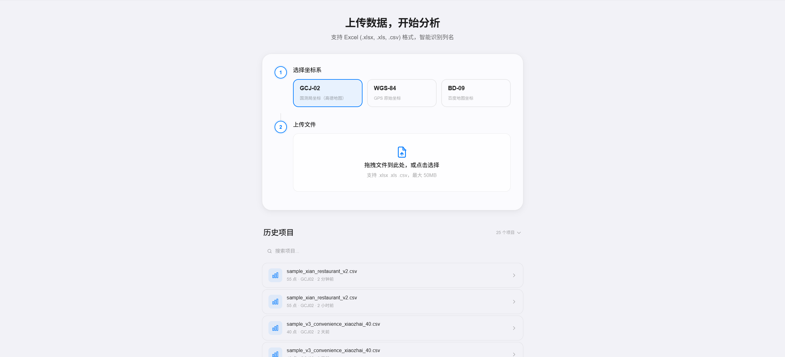
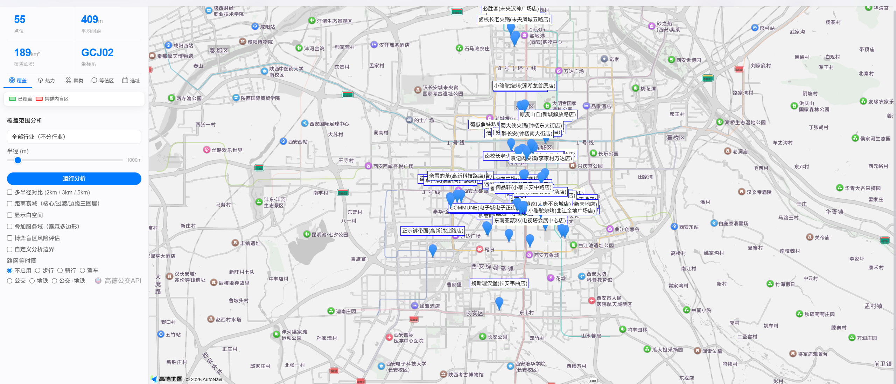
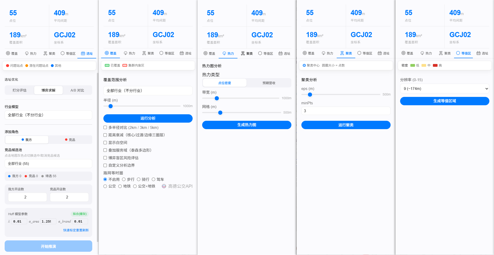

# 区域数据分析平台

基于 PostGIS + Express + Vue3 的空间数据分析 SaaS 平台，支持快速选址分析、多点位覆盖分析、热力图、聚类分析、选址优化、竞争博弈、12 行业深度模型等功能。

---

## 效果预览

| 快速选址分析 | 我的数据 |
|:---:|:---:|
|  |  |

| 覆盖分析 | Dashboard 分析 |
|:---:|:---:|
|  |  |

---

## 功能分层

### 免费版

- 快速选址分析（基于平台公开 POI 数据，无需上传）
- 候选点位打分排名
- 分析报告导出（PDF）
- 分析记录保存

### 专业版

免费版全部能力 +
- 上传自有数据（Excel / CSV，智能列识别）
- 完整覆盖分析（多半径对比、缓冲区叠加、盲区识别）
- 热力图 / 聚类分析 / H3 六边形栅格
- 选址优化（多候选点综合评分）
- 竞争博弈模型（leader-follower 求解）
- 行业基准对标
- 完整分析报告（含基准对标、决策建议）

> 升级方式：联系管理员开通，详见定价页。

---

## 技术栈

| 层 | 技术 |
|------|------|
| 前端 | Vue 3 + TypeScript + Vite 8 + Pinia + 高德地图 JS API 2.0 |
| 后端 | Express 4 + TypeScript + pg-promise + BullMQ |
| 计算引擎 | Python / FastAPI（Huff 引力模型 MLE 拟合、博弈选址求解） |
| 数据库 | PostgreSQL 16 + PostGIS 3 |
| 缓存 | Redis 7（iOredis + BullMQ 队列） |
| 路网 | OSRM（驾车/步行/骑行等时圈）+ 高德公交 API |
| 安全 | JWT 双密钥轮换 + Helmet + express-rate-limit + bcrypt 12 轮 |
| 日志 | Pino 结构化日志 + trace ID + 隐私脱敏 |
| 编排 | Docker Compose（postgis / redis / osrm / backend / compute-engine / nginx） |
| 坐标系 | WGS-84 / GCJ-02 / BD-09 互转（coordtransform） |

---

## 项目结构

```
├── backend/                # Express TypeScript 后端
│   └── src/
│       ├── config/         # 配置（app / analysis / industry）
│       ├── controllers/    # 路由控制器（auth / web / apiV1）
│       ├── services/       # 核心业务
│       │   └── analysis/   # 分析引擎（benchmark / hull / kpiNormalizer）
│       ├── middleware/     # 认证（JWT 双密钥）/ 限流 / 错误处理 / 日志
│       ├── jobs/           # BullMQ 异步任务 + POI 采集器
│       ├── workers/        # 任务执行器
│       └── validators/     # 参数校验
├── compute-engine/         # Python FastAPI 计算引擎
│   └── app/
│       ├── config.py       # 引擎配置
│       └── main.py         # Huff MLE / 博弈求解 API
├── frontend-vue/           # Vue 3 + TypeScript 前端
│   └── src/
│       ├── views/          # 页面（快速分析 / 上传 / Dashboard / 报告 / 定价）
│       ├── components/     # 组件（dashboard / shared / upload）
│       ├── stores/         # Pinia（auth / project / config / industry / analysis）
│       ├── composables/    # useAmap / useToast
│       ├── api/            # axios 封装
│       └── router/         # Vue Router + auth guard
├── database/               # 建库脚本 + 迁移（001-019）
├── nginx/                  # 反向代理配置
├── sample-data/            # 测试数据
├── docker-compose.yml      # 多服务编排
└── .env.example            # 环境变量模板
```

---

## 快速开始

```bash
# 1. 配置环境变量
cp .env.example .env
# 编辑 .env，填入高德 API Key、JWT 密钥、SMTP 等

# 2. 启动全部服务
docker compose up -d

# 3. 访问
# 前端: http://localhost:8080
# 后端: http://localhost:3000
# 计算引擎: http://localhost:8000

# 可选：加载 OSRM 路网数据（中国大陆）
wget https://download.geofabrik.de/asia/china-latest.osm.pbf
docker run -v $(pwd)/china-latest.osm.pbf:/data/osm.pbf osrm/osrm-backend osrm-extract -p /opt/car.lua /data/osm.pbf
docker run -v $(pwd):/data osrm/osrm-backend osrm-partition /data/osrm-data.osrm
docker compose --profile with-osrm up -d
```

---

## API 接口

| 方法 | 路径 | 认证 | 说明 |
|------|------|:---:|------|
| POST | /api/auth/register | | 注册（图形验证码 + 邮箱 OTP） |
| POST | /api/auth/verify-email | | 验证邮箱 |
| POST | /api/auth/login | | 登录（返回 JWT + subscriptionTier） |
| GET | /api/auth/me | ✓ | 当前用户信息 |
| POST | /api/auth/logout | ✓ | 登出 |
| POST | /api/auth/refresh | | 刷新 token |
| POST | /api/web/upload | ✓ | 上传数据文件 |
| POST | /api/web/upload/confirm | ✓ | 确认列映射并导入 |
| GET | /api/web/projects | ✓ | 项目列表 |
| GET | /api/web/projects/:id/summary | ✓ | 项目概览 |
| GET | /api/web/projects/:id/points | ✓ | 项目点位（分页） |
| DELETE | /api/web/projects/:id | ✓ | 删除项目（软删除） |
| POST | /api/web/projects/:id/restore | ✓ | 恢复项目 |
| GET | /api/web/projects/:id/analysis/coverage | ✓ | 覆盖分析 |
| GET | /api/web/projects/:id/analysis/heatmap | ✓ | 热力图（KDE） |
| GET | /api/web/projects/:id/analysis/clusters | ✓ | 聚类分析（DBSCAN） |
| POST | /api/web/projects/:id/analysis/site-optimization | ✓ | 选址优化 |
| GET | /api/web/projects/:id/analysis/h3-hexagons | ✓ | H3 六边形栅格 |
| POST | /api/web/projects/:id/game/solve | ✓ | 博弈选址求解 |
| POST | /api/web/quick-analysis/create-project | ✓ | 快速分析创建临时项目 |
| GET | /api/web/projects/:id/export/report | ✓ | 导出分析报告（含 projectType） |
| GET | /api/web/industries | ✓ | 12 行业列表 + KPI 中文映射 |
| GET | /api/web/industries/:industry/model | ✓ | 行业详细配置 |
| GET | /api/web/poi/search | ✓ | 竞品 POI 搜索 |
| GET | /api/web/demand/h3-grid | ✓ | 人口消费力 H3 栅格 |
| GET | /api/web/system/config | | 系统配置（subscriptionMode） |
| GET | /api/health | | 健康检查（DB + Redis） |

---

## 安全机制

| 类别 | 措施 |
|------|------|
| 认证 | JWT 双密钥轮换（jwt_signing_keys 表）+ 图形验证码 + 邮箱 OTP |
| 授权 | authRequired 中间件 + 多租户 tenant_id 隔离 |
| 限流 | 全局 100/min，登录 5/min，注册 5/min，分析 10/min |
| 账号保护 | 密码错误 5 次锁定 15min，bcrypt 12 轮，禁止一次性邮箱 |
| 接口安全 | Helmet 安全头 + CORS 白名单 + API Key HMAC-SHA256 签名 |
| SQL 注入 | pg-promise 全量参数化查询 |
| 日志审计 | Pino 结构化日志 + trace ID + 隐私脱敏（邮箱/手机/坐标） |
| 前端安全 | isPro 只读服务端返回，不可前端篡改 |

---

## 版本历史

| 版本 | 主要变更 |
|------|---------|
| v3.2 | 两层订阅架构、Bug 修复、安全加固，详见 [CHANGELOG_v3.2.md](CHANGELOG_v3.2.md) |
| v3.0 | 混合计算引擎（Python/FastAPI）、Huff 引力模型 MLE、博弈选址求解 |
| v2.0 | 12 行业深度模型、KPI 归一化引擎、决策建议引擎、路网等时圈 |
| v1.0 | MVP：上传数据、覆盖分析、热力图、聚类 |
